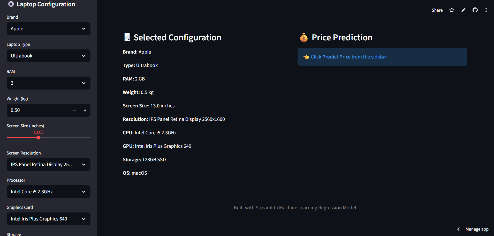
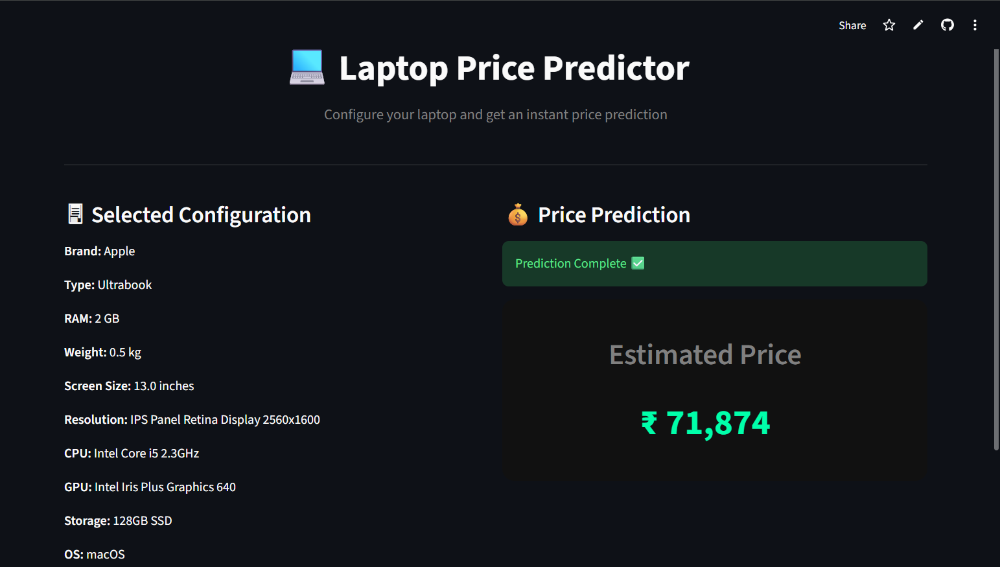

# 💻 Laptop Price Predictor

A Machine Learning powered web application that predicts laptop prices based on hardware specifications. Built using **Scikit-Learn**, **Pandas**, and deployed with **Streamlit**.

---

## 🚀 Live Demo

👉 **Try the Live Application:**
[https://smart-laptop-pricer.streamlit.app/](https://smart-laptop-pricer.streamlit.app/)

---

## 📌 Project Overview

Laptop pricing depends on multiple factors such as:

* Brand
* Processor
* RAM
* Storage
* GPU
* Display
* Weight
* Operating System

This application uses a **Regression Machine Learning Model** to estimate the price based on user-selected configurations.

---

## ✨ Features

✅ Interactive UI using Streamlit
✅ Real-time price prediction
✅ Clean & modern interface
✅ Dynamic feature handling
✅ Model trained using real dataset

---

## 🖥️ Application Screenshots

### 🔹 Configuration Screen



---

### 🔹 Price Prediction Output



---

## 🧠 Machine Learning Model

The prediction engine is built using:

* **Scikit-Learn Pipeline**
* **ColumnTransformer** for preprocessing
* **Regression Algorithm**

The pipeline automatically handles:

✔ Categorical Encoding
✔ Feature Transformation
✔ Prediction Logic

---

## 📊 Dataset

The model was trained on a laptop specifications dataset containing:

* Hardware configurations
* Brand details
* Pricing information

---

## 🛠️ Tech Stack

* **Python**
* **Pandas**
* **NumPy**
* **Scikit-Learn**
* **Streamlit**

---

## ⚙️ Installation & Run Locally

Clone the repository:

```bash
git clone https://github.com/your-username/laptop-price-predictor.git
cd laptop-price-predictor
```

Install dependencies:

```bash
pip install -r requirements.txt
```

Run the app:

```bash
streamlit run app.py
```

---

## 🎯 Use Cases

✔ Price estimation tool
✔ ML project demonstration
✔ Portfolio / Resume project
✔ Data Science practice

---

## 📈 Future Improvements

* Add multiple ML model comparison
* Improve prediction accuracy
* Add laptop image previews
* Deploy with custom domain

---

## 👨‍💻 Author

**Vishwajit Deshmukh**

---

## ⭐ If you like this project

Give it a ⭐ on GitHub!
